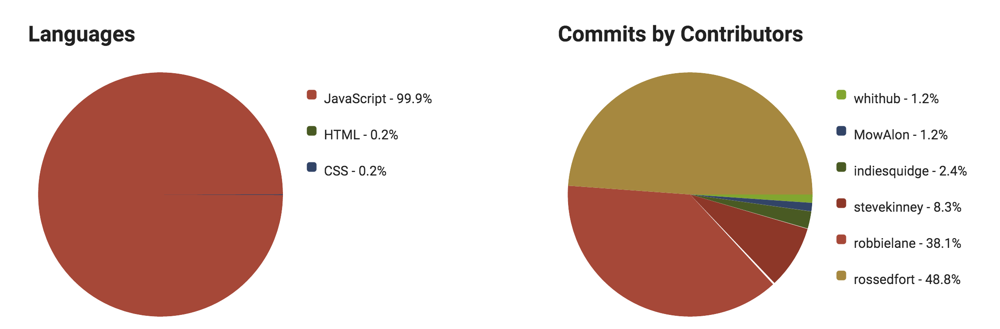
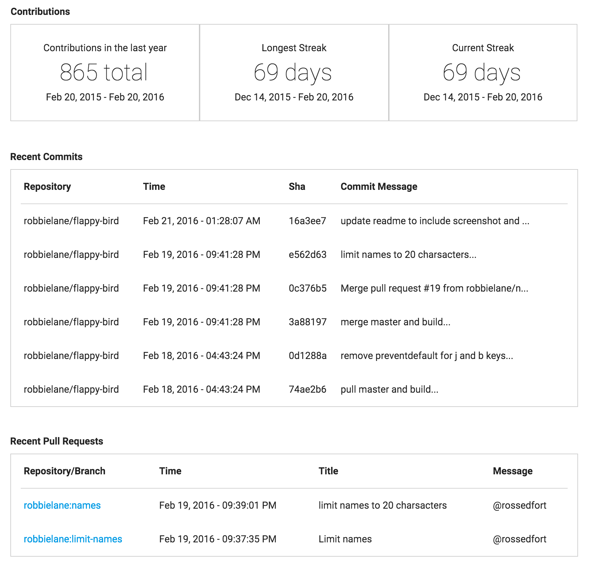

# Github Bud
A project that uses Github's API and OAuth to show statistics and graphs about github users and their repositories. This was for a Module 3 project at [Turing School of Software and Design](http://turing.io) named [API Curious](https://github.com/turingschool/curriculum/blob/master/source/projects/apicurious.markdown).  

Visit the production site at [http://githubbud.herokuapp.com](http://githubbud.herokuapp.com)

### Repo Graphs

Each repository shows graphs that break down the commit history and languages used.

### User Stats and Recent Activity

